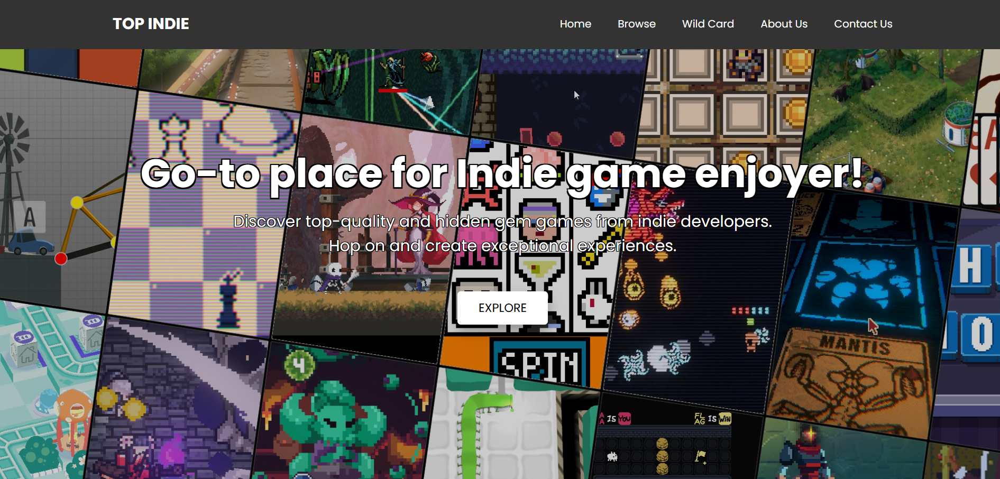
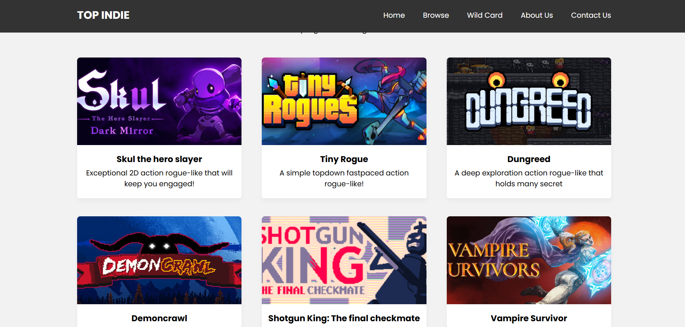
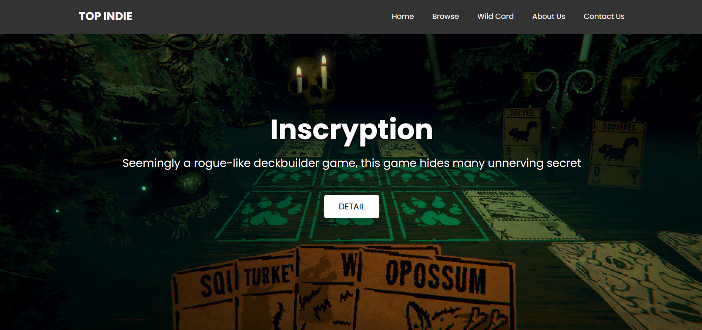

# 🌐 Indie Top frontend (HTML)

A lightweight **HTML/CSS** frontend for a game review website.  
Designed for user to browse available catalog of game, view details, and explore easily through a clean, responsive interface.

---

## 📂 How to Use

> 🔎 Simply open the `index.html` file in any modern web browser.

---

## 🖼️ Screenshots

<b>🔷 Front Page</b>

  

<b>🔽 Scroll Down</b>

  

<b>📄 Game Detail Page</b>

  

<b>🖥️ Alternate Browser Width</b>

  

---

## 🧠 Features

- Browse all available games on the main page
- Clickable course detail view with key information
- Fully static — no server needed
- Works offline in local environments
- Responsive layout adapts to browser size

---

## 🛠 Built With

- 🧱 **HTML5**
- 🎨 **CSS3**
- 🖼️ **Responsive layout** (media queries)
- 💡 Designed to match the Windows Forms backend system

---

> *Note: This frontend is currently static. Dynamic connection to SQL/database will require future integration with a backend API.*
